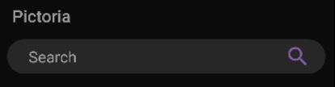

# Pictoria
Pictoria is a basic android application for searching high quality images and viewing it.

## Demonstration

  

## Features

It shows an animated Splash Screen with a beautiful User Interface.

It has a search bar to search using the name.

It fetches the url of images using an API and then shows it in a RecyclerView using Adapter.

## Libraries

1. **Retrofit**  (retrofit - 2.4.0) & (converter-gson - 2.2.0)
- Used for sending GET request and receiving its response.

2. **Glide** - 4.6.1
- Used for displaying the images using the URL.

3. **Lottie** - 3.7.0
- Used for animating the Splash Screen.

## API

[Pixabay API](https://pixabay.com/service/about/api/)
