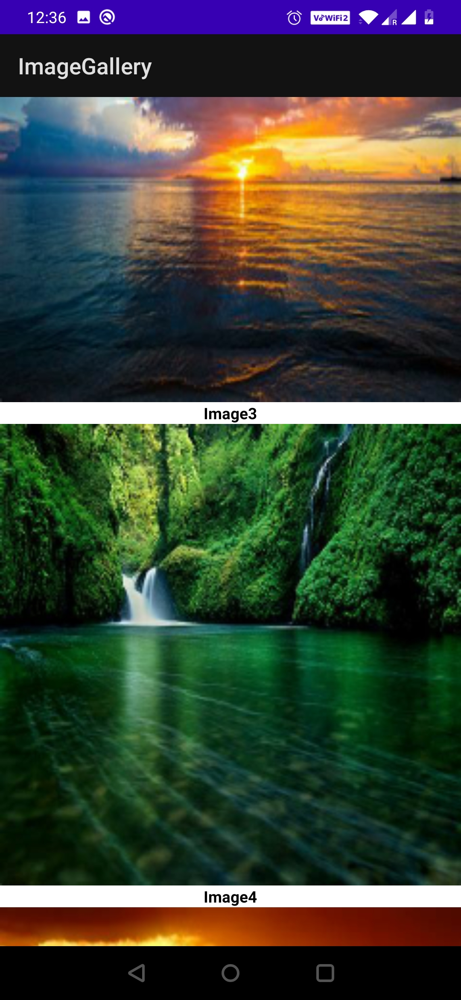
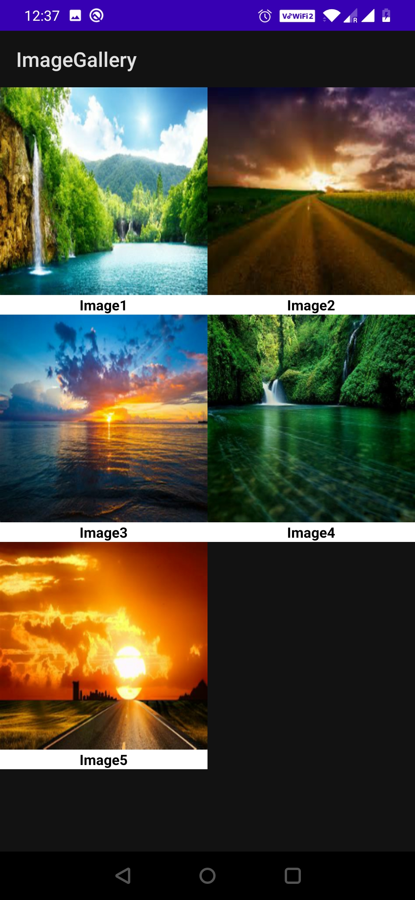

# ImageGallery-APP

# Introduction
This is an app to display all the images with given URLs in vertical scrollable view

## Library 
To download images from the web, we use PICASSO library

If you want to know more about Picasso [refer this link](https://protocoderspoint.com/picasso-android-tutorial-image-loader-library/)

## Dependencies
add it to your _**build.gradle**_ file

dependencies {

    implementation 'com.squareup.picasso:picasso:2.71828';
    
}

GET INTERNET ACCESS (add it to your _**AndroidManifest.xml**_ file)

uses-permission android:name="android.permission.INTERNET"

# Screenshots

